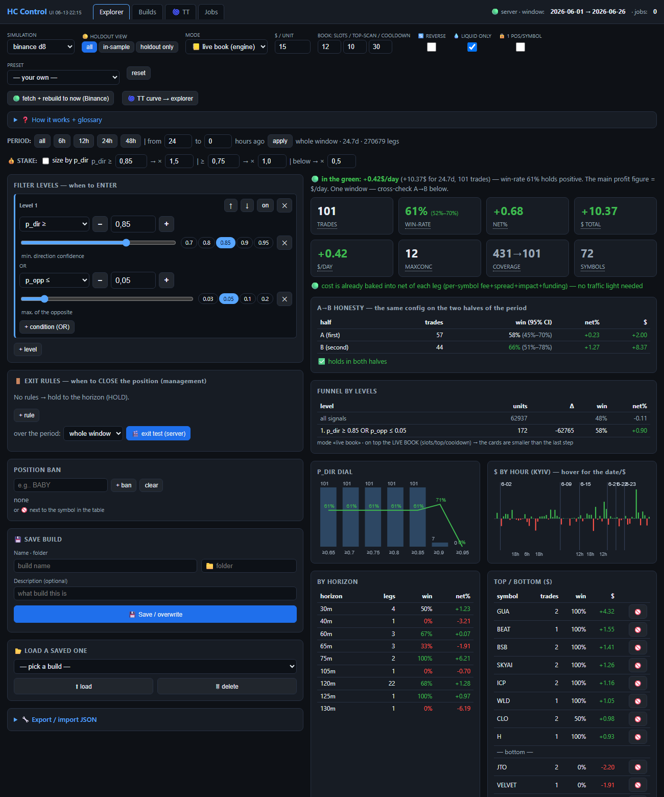
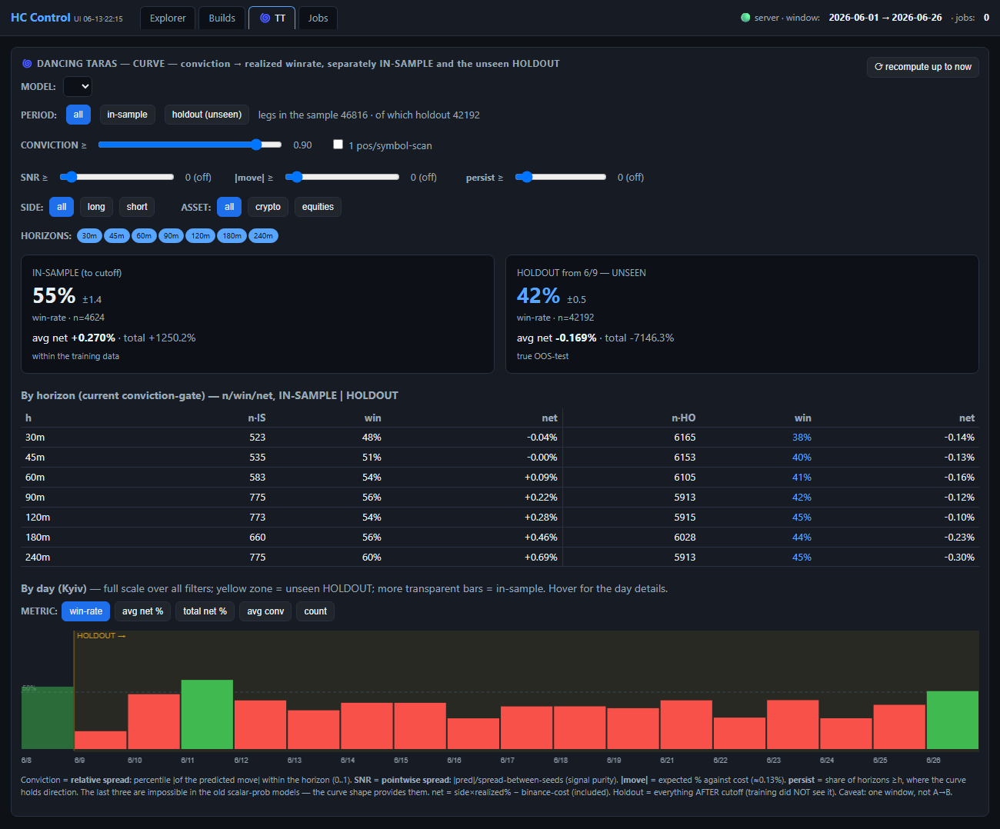

<div align="center">

# 🪩 Dancing Horizon

### Horizon-conditioned machine-learning trading signals for crypto & tokenized equities

*A research engine that learns, for any symbol and **any** future horizon, the calibrated
probability that a trade clears its cost — then trades only the high-conviction tail.*

[](https://www.python.org/)
[](https://catboost.ai/)
[](LICENSE)
[](#-contributing)
[](https://github.com/yevchyk/dancing_gorizon/stargazers)

**If this project teaches you something, please ⭐ star it — it genuinely helps.**

</div>

---

## TL;DR

- 🎯 **One model, every horizon.** A horizon-conditioned CatBoost pair outputs a full
  *probability-vs-time curve* for each signal, not a single up/down guess.
- 📊 **Judged by calibration, not by a pretty backtest.** The core artifact is a table of
  *realized* win-rate per probability bucket. The edge is real and measured on millions of
  unseen samples.
- 🤪 **The code is vibecoded spaghetti. The results are not.** ~73–87% directional win-rate
  on the high-conviction tail, out-of-sample.

```bash
git clone https://github.com/yevchyk/dancing_gorizon.git
cd dancing_gorizon
python -m venv .venv && .venv/Scripts/pip install -r requirements.txt
# score the bundled model on live public market data — no API keys needed:
.venv/Scripts/python -m src.run_hc_live --shadow --once --selection-mode quality --model-dir models/hc_exec_to20260604_prod
```

---

<div align="center">

### The control panel & signal explorer



*Everything computed in the browser over a saved model: live calibration, the A→B honesty
check (same config on both halves of the period), per-horizon edge, the entry funnel,
$/day, and the conviction dial — the whole research loop on one page.*

</div>

---

## Table of contents

- [What is this?](#what-is-this)
- [How it works — in plain English](#how-it-works--in-plain-english)
- [The one idea that pays](#the-one-idea-that-pays-the-high-conviction-tail)
- [Architecture](#architecture)
- [A brutally honest note on the code](#-a-brutally-honest-note-on-the-code-read-this-part)
- [What works · what doesn't](#what-works--what-doesnt-hard-won-keep)
- [Requirements](#-requirements)
- [Installation](#-installation)
- [Quickstart (no keys)](#-quickstart-runs-immediately-no-keys)
- [The full pipeline: fetch → build → train → evaluate → run](#-the-full-pipeline-fetch--build--train--evaluate--run)
- [Data & models are not in this repo](#️-data--models-are-not-in-this-repo)
- [Going live](#-going-live-optional-at-your-own-risk)
- [Project layout](#-project-layout)
- [FAQ](#-faq)
- [Contributing](#-contributing)
- [Disclaimer](#️-disclaimer)
- [License](#license)

---

## What is this?

Dancing Horizon is a **quantitative trading / signal-research system** for short-horizon
directional bets on perpetual swaps (crypto **and** tokenized equities like MU, ORCL, QCOM,
PLTR, META, TSM, MRVL). It is a complete pipeline: it **fetches market data**, **builds
features**, **trains ML models**, **measures where the edge actually is**, **backtests**
leak-free, and can **execute live** on OKX and Binance.

Most ML-for-trading projects predict "up or down" at one fixed horizon and then drown in
transaction costs. Dancing Horizon does two things differently, and both turned out to
matter:

1. **Horizon is a model input, not a fixed choice.** A single pair of gradient-boosted
   models (one for *up*, one for *down*) is **conditioned on the horizon** you ask about.
   Ask it about 30 minutes or 120 minutes and it returns `P(profit | that horizon)`. Because
   horizon is continuous, you get a whole **probability-vs-time curve** per signal.

2. **It is judged by its calibration, not by a backtest curve.** The core artifact is a
   *gradator* — a table of **realized win-rate and average net P&L per probability bucket**.
   It answers the only question that matters: *where is the edge actually real?* Engines,
   position sizing, and caps are tuned **afterwards**, on top of a model you already trust.

The whole thing is **symbol-blind**: the ~302 features describe *relative* price/volume
shape plus a BTC reference, never the ticker name. That's why models trained on crypto
**transfer to never-before-seen instruments**, including equities they never saw in training.

> **Keywords:** algorithmic trading · machine learning trading signals · CatBoost · gradient
> boosting · crypto quant · probability calibration · walk-forward backtest ·
> horizon-conditioned model · OKX · Binance · perpetual futures · market microstructure ·
> quantitative finance · Python trading bot.

---

## How it works — in plain English

Imagine you could ask one question, millions of times a day, across hundreds of assets:

> *"If I open this trade right now and close it in N minutes, what's the probability it ends
> up profitable after fees and slippage?"*

That's the whole product. The system:

1. **Watches the market** every 5 minutes for ~200–300 symbols.
2. For each symbol, **summarizes the recent past** into a few hundred numbers (relative
   price and volume curves over 5m / 15m / 1h / 4h, plus what Bitcoin is doing).
3. **Asks the model** that question above, for several horizons at once.
4. **Keeps only the loudest, most-confident answers** (the high-conviction tail) — and
   *ignores everything else*, because the experiments proved that's where the only durable
   edge lives.
5. On flat, boring days it correctly **says nothing and sits out**.

The model isn't a black box you have to trust on faith: every prediction is **calibrated**
against reality. "Probability 0.90" actually means "~85% of these won, historically, on data
the model never trained on." That calibration table is how you know it works — and it's the
first thing you should look at.

---

## The one idea that pays: the high-conviction tail

Five separate experiments, three model families, multiple market regimes — same wall every
time:

- **Loosening the gate to get more volume *always* kills win-rate** and pushes you below
  50%. Frequency multiplies exposure; it does **not** dilute losses.
- **The edge lives in the tail.** `up_prob`/`down_prob ≥ ~0.80–0.90` (or a clean spread, or
  `p_dir ≥ 0.80 & p_opp ≤ 0.05`). Below ~0.80 it *loses*.
- **On calm / bad days there is no extractable edge by any method** we tried (raw, blend,
  overlay, calibrator, from-scratch model, EV-regressor — all failed out-of-sample, several
  inverted). You don't squeeze a dead day. You **detect it and sit out.**

To get *"same win-rate, much more volume,"* you don't loosen the gate — you **multiply the
space**: `signals = symbols × horizons × scans × P(clear the high bar)`. Keep the bar, grow
the rest (more symbols, multi-leg per scan, ensemble seeds). Realistic "imba" is not a higher
win-rate — it's **×5–10 volume at the same ~62–65%.**

---

## Architecture

```mermaid
flowchart LR
    A[OKX / Binance<br/>public APIs] -->|fetchers| B[(Candle store<br/>5m·15m·1h·4h)]
    B --> C[Feature builder<br/>~302 symbol-blind features<br/>+ horizon_minutes]
    C --> D[CatBoost UP model]
    C --> E[CatBoost DOWN model]
    D --> F[P&#40;profit · horizon&#41;<br/>continuous curve]
    E --> F
    F --> G[Calibration / gradators<br/>realized win% per bucket]
    G --> H[Engine<br/>threshold · ranking · caps · cooldown]
    H --> I{Mode}
    I -->|--shadow| J[Log signals,<br/>no orders]
    I -->|--live| K[OKX / Binance<br/>executor]
```



**The flow, step by step:**

| # | Stage | What happens | Code |
|---|-------|--------------|------|
| 1 | **Data → features** | Every 5m, per symbol: build ~302 features at `t−5m` (relative price/volume over 4 timeframes + BTC ref + `horizon_minutes`). | `dh.data` |
| 2 | **Training** | Two CatBoost models (UP, DOWN), horizon-conditioned, trained to a **cutoff date** → everything after is clean out-of-sample. Leak-free: features at `t`, **entry at `t+5m`**, exit at `t+5m+horizon`. | `src/run_hc_prod_train.py` |
| 3 | **Calibration** | Bin signals by score, measure the **real** realized win-rate per bin. This is how we learned *where* the edge is. | `dh.calibration` |
| 4 | **Sim / backtest** | Executable outcomes on a mature OOS window: slot scheduler, conviction sizing, slippage, capital caps. Always reported OOS. | `dh.sim` |
| 5 | **Engines** | A selection rule on top of probabilities: threshold + ranking + caps + cooldown. Different models get different controllers; multiple engines run as **one shared risk book**. | `src/trading/` |
| 6 | **Live** | OKX / Binance executors (real fills, reduce-only partial closes), per-leg deadlines, 5-minute scan loop. Default mode everywhere is `--shadow` (no orders). | `src/trading/` |
| 7 | **Report** | One command ties any date range together. | `dh.report.stats` |

---

## 🤪 A brutally honest note on the code (read this part)

Let me set expectations.

**This is vibecode.** It was hammered out at 3 a.m. across dozens of sessions, with files
named `_tmp_ntree_probe.py`, three half-abandoned data schemas, a `src/` folder nobody is
allowed to edit "casually," and a `dh/` folder that was supposed to be the clean rewrite and
is now its own kind of swamp. There are functions that take a `--no-early-stop` flag because
the *alternative* was a model that silently collapsed to three trees. There is a comment in
the codebase that is, essentially, *"do NOT reintroduce the secret-exam pipeline, we ripped
it out for a reason."*

It is, by any reasonable software-engineering standard, **a mess.**

**And yet — IT SEES SOMETHING.** 👀

On clean out-of-sample windows, the high-conviction tail (`p_dir ≥ 0.90`) lands **73–87%
directional win-rate** on **millions** of held-out samples — not on the days it was fitted,
on genuinely unseen days. The calibration is *monotone*: higher predicted probability really
does mean higher realized win-rate, bucket after bucket, across disjoint time slices. The
dense-trained models hit **78–79% / +1.0–1.2% net** on a 48-hour date-OOS holdout across
250+ symbols. That is not nothing. That is the spaghetti **quietly working.**

So: the engineering is embarrassing, the result is not. This README documents *both* honestly,
because the lessons below were paid for in real losing days, and they're the actual value
here — not the code style.

---

## What works · what doesn't (hard-won, keep)

**✅ Works**
- Leak-free timing (features at `t`, enter at `t+5m`).
- The high-conviction tail (`p_dir ≥ ~0.90`).
- **Calibration tables over cascade filters** — use score generators as an *OR pool*, then
  rank, instead of stacking hard AND-filters.
- Conviction sizing (size ∝ `p_dir − p_opp`).
- **No stops / no take-profit** — winners must run to the horizon; caps and stops hurt the edge.
- Letting the system sit out bad days.
- **Dense-horizon *training*** (5–180 min on a 5-minute grid) — makes the model learn the
  real continuous `P(profit | horizon)` curve.

**❌ Does not work (stop trying)**
- More frequency / lower threshold → the losing zone.
- Adding the **raw symbol name** as a feature → didn't help, hurt at volume, and *broke* the
  symbol transfer that makes this thing interesting.
- Opposite-prob filters / blends / overlays beyond the raw tail → ~nothing.
- Trading every day → the edge is regime-dependent.
- **Dense-horizon *querying* at inference** → max-prob across many horizons cherry-picks the
  model's most over-confident horizon. Train dense; *query* sparse ({30, 60, 90}) with
  high-conviction gates.

---

## 📦 Requirements

- **Python 3.11+** (the stack uses NumPy 2.x / pandas 3.x / pyarrow / scikit-learn).
- **~2 GB** free disk for code + sample; **a lot more** (tens of GB) if you rebuild the full
  candle store yourself.
- **Internet access** — the fetchers pull *public* market data (no API key required for data).
- *(optional)* a **CUDA GPU** — CatBoost trains much faster on GPU for the dense/deep models.
  Everything also trains on CPU, just slower.
- *(optional, only for live trading)* **OKX and/or Binance API keys**.

All Python dependencies are pinned in [`requirements.txt`](requirements.txt).

---

## 🛠 Installation

```bash
# 1. clone
git clone https://github.com/yevchyk/dancing_gorizon.git
cd dancing_gorizon

# 2. create an isolated environment
python -m venv .venv

# 3. install dependencies
#    Windows (PowerShell):
.venv\Scripts\pip install -r requirements.txt
#    macOS / Linux:
#    .venv/bin/pip install -r requirements.txt
```

> All commands below are shown for **Windows PowerShell** (`.\.venv\Scripts\python`). On
> macOS/Linux use `./.venv/bin/python` instead. Always run from the project root.

---

## ⚡ Quickstart (runs immediately, no keys)

This loads the bundled model and scores it against **live public market data** (no API key
needed — public candles are free). It runs one scan and prints any high-conviction signals,
**without placing a single order**:

```powershell
.\.venv\Scripts\python -m src.run_hc_live --shadow --once --selection-mode quality `
  --model-dir models\hc_exec_to20260604_prod `
  --stake-margin 5 --leverage 1 --top-per-scan 3 --max-concurrent 6
```

- `--shadow` → live data, **no orders** (the default, safe mode).
- `--once` → run a single scan and exit (drop it to keep scanning every 5 min).
- A quiet market legitimately prints **zero signals** — the model only fires on
  high-conviction setups. That is the system working correctly, not a bug.

The repo also bundles a tiny **offline candle sample** (`data/binance_smoke/`, ~2 symbols)
so the data layer and feature builder have something to chew on without any download.

---

## 🔄 The full pipeline: fetch → build → train → evaluate → run

The bundled sample is just enough to see the machinery move. To do real research you rebuild
the data and train your own models. Everything runs from the project root via `python -m ...`.

### 1. Fetch candles (public data, no keys)

```powershell
# OKX — one full sweep of the candle-store universe, then exit
.\.venv\Scripts\python -m src.run_fetcher --once --universe store --workers 10

# OKX — (re)build / backfill the separate long-history 200-symbol store
.\.venv\Scripts\python -m src.run_okx_stable200_build
.\.venv\Scripts\python -m src.run_okx_stable200_backfill --workers 4 --update

# Binance — the overnight driver chains everything: candle top-up -> funding history ->
# honest cost model -> alignment check -> a full 365d x 1m dataset -> depth sweep.
.\.venv\Scripts\python -m src.run_binance_overnight
```

Candles land under `data/...` (OKX: `data/candles`, Binance: `data/binance*`). Check coverage
any time:

```powershell
.\.venv\Scripts\python -m src.run_data_inventory
```

### 2. Build a training dataset

Turn raw candles into leak-free feature/label rows (features at `t`, entry at `t+5m`, exit at
`t+5m+horizon`). Train on a **dense** horizon grid (train dense, query sparse):

```powershell
# OKX HC dataset
.\.venv\Scripts\python -m src.run_hc_dataset

# Binance v5 dataset (dense 30..320 every 5 min). --fresh rebuilds from scratch.
.\.venv\Scripts\python -m src.run_binance_dataset_v5 --workers 8 --fresh
```

### 3. Train

Two horizon-conditioned CatBoost models (UP, DOWN), trained to a **cutoff date** so everything
after is clean out-of-sample. Use `--no-early-stop` on calm windows so the model doesn't
collapse to three trees:

```powershell
.\.venv\Scripts\python -m src.run_hc_prod_train --no-early-stop --depth 7 --iterations 6000
```

The cutoff is `data-edge − HOLDOUT_DAYS`, computed at runtime — the last N days are simply
held out as the unseen test. There is no frozen/sealed test fixture anywhere in the code.

### 4. Evaluate by calibration ← the important step

Look at the **gradators** — realized win-rate and net per probability bucket — on the held-out
tail. This, not an equity curve, tells you whether the model is real.

```powershell
# scorecard / calibration on a holdout window (the "MASK SUMMARY" = the gradator table)
.\.venv\Scripts\python -m src.run_hc_scorecard_analysis --date 2026-06-01 --days 4 --model old

# per-horizon edge / multi-leg / opp-cap profile — do this BEFORE wiring any engine
.\.venv\Scripts\python -m src.run_hc_funnel
```

### 5. Explore & run

```powershell
# full stats for a date range (the main report tool)
.\.venv\Scripts\python -m dh.report.stats --date 2026-06-04 --days 1 --models new,old --slip 0.6

# local web explorer + control panel (localhost only) -> http://127.0.0.1:8765
.\.venv\Scripts\python -m dh.webapp.server

# shadow a single engine (safe), or a portfolio of saved builds as one shared risk book
.\.venv\Scripts\python -m src.run_hc_live --shadow --selection-mode bad_day_worker `
  --model-dir models\hc_exec_to20260604_prod --bdw-raw 0.80 --bdw-opp 0.05
.\.venv\Scripts\python -m src.run_hc_portfolio_live --portfolio configs\builds\portfolio_5x3.json --shadow
```

---

## ⚠️ Data & models are NOT in this repo

The full research store is **~46 GB** (29.6 GB of 1-minute candles across ~200 symbols × 365
days, plus 16 GB of trained model artifacts). That does not belong on GitHub, so it is
**git-ignored**. What ships instead:

- ✅ all the **code** (`src/`, `dh/`, `configs/`)
- ✅ a **tiny runnable sample** — `data/binance_smoke/` and one small trained model,
  `models/hc_exec_to20260604_prod/` — so the quickstart works out of the box
- ✅ the **decision records** in `reports/*.md` (the real story of what we learned)
- ❌ the full candle store, the big models, logs, `.venv`, and `.env`

The candle store is **rebuilt locally from the exchange public APIs** ([step 1](#1-fetch-candles-public-data-no-keys)
above) — no keys required to download market data. This is a research engine, not a dataset
release.

---

## 🔴 Going live (optional, at your own risk)

Copy `.env.example` to `.env` and add **your own** exchange keys. Keep `OKX_DEMO=1` while
testing. Live runners (`--live`) self-guard on missing credentials and should only be used
after forward-shadow validation. **Start small.**

```powershell
.\.venv\Scripts\python -m src.run_hc_live --live --selection-mode bad_day_worker `
  --model-dir models\hc_exec_to20260604_prod --bdw-raw 0.80 --bdw-opp 0.05 `
  --stake-margin 5 --leverage 2 --top-per-scan 3 --max-concurrent 6
```

`.env` is git-ignored and must **never** be committed. The code only ever reads the *names*
of these variables; no key value is hard-coded anywhere.

---

## 📁 Project layout

```
dancing_horizon/
├── dh/              clean reusable layer — config, data, models, sim, calibration, report, webapp
├── src/             the vendored proven engine (training, live executors, runners)
├── configs/         universes, thresholds, cost models, saved builds
├── reports/         decision records (*.md) — the actual hard-won knowledge
├── models/          [git-ignored except one sample model]
├── data/            [git-ignored except data/binance_smoke]
├── CLAUDE.md        the no-nonsense working notes (rules we stopped re-deriving)
├── DANCING_TARAS.md the spec for the next paradigm (regress the whole price curve)
└── README.md        you are here
```

`CLAUDE.md` and `DANCING_TARAS.md` are the unvarnished engineering logs — if you actually
want to understand the project's reasoning, read those.

---

## 🌀 Beyond classification: regressing the whole price curve (Dancing Taras)

The next paradigm (spec in [`DANCING_TARAS.md`](DANCING_TARAS.md)) stops predicting a single
`P(profit)` and instead **regresses the entire forward price curve** as a multi-output
target, with the horizon as the *output* axis. The explorer has a dedicated tab for it,
including the most important tool in the whole project: an **IN-SAMPLE vs unseen HOLDOUT**
split that makes overfitting impossible to hide.

<div align="center">



*The curve model, judged honestly: 55% win-rate in-sample vs 42% on the unseen holdout —
the tab tells you immediately that **this particular model is overfit**. Curve-native
filters (conviction, SNR, |move|, persistence) and a per-horizon IS|HO table come for free
from regressing the shape instead of a scalar.*

</div>

---

## ❓ FAQ

**Is this profitable / can I just run it and make money?**
No promises. It measures a real, calibrated edge on past out-of-sample data, but markets
change and an edge can vanish forward. Treat it as research. Default to `--shadow`, and if you
ever go live, start tiny.

**Do I need API keys to try it?**
No. Fetching market data and running `--shadow` need no keys (public data is free). Keys are
only for placing real orders.

**Does it work on stocks?**
Yes — tokenized equities (e.g. MU, ORCL, QCOM, PLTR, META, TSM, MRVL) are mixed into the
universe, and the high-conviction tail transfers to them because the features are symbol-blind.

**Why CatBoost and not a deep neural net?**
Gradient-boosted trees are strong on tabular market features, train fast, calibrate well, and
don't need a GPU to be usable. The next paradigm (`DANCING_TARAS.md`) explores regressing the
whole forward price *curve* as a multi-output target.

**Where do I start reading the code?**
`dh/` is the clean layer. Start at `dh/report/stats.py`, then `dh/data/` and `dh/models/`.

---

## 🤝 Contributing

PRs and issues are welcome. Good first contributions: better docs, a Linux/macOS test of the
quickstart, packaging (`pyproject.toml`), or cleaning up one of the `_tmp_*` scratch scripts.

1. Fork the repo and create a feature branch.
2. Keep changes focused; explain the *why* in the PR description.
3. Don't commit data, models, logs, or `.env`.

If you build something on top of this, I'd love to hear about it — open an issue.

---

## ⚖️ Disclaimer

This is **research and educational** software. It is **not financial advice**, not a
recommendation, and not a promise of profit. Markets change; an edge measured on past
out-of-sample windows can vanish forward. Trading leveraged perpetual futures can lose you
more than your stake. **If you point this at a real account, you do so entirely at your own
risk.** Default to `--shadow`. Start small. The authors are not responsible for your P&L.

## License

MIT — see [`LICENSE`](LICENSE). Do what you want; just don't blame us.

---

<div align="center">

**Found this useful or interesting? Drop a ⭐ — it's the cheapest way to support the project.**

</div>
